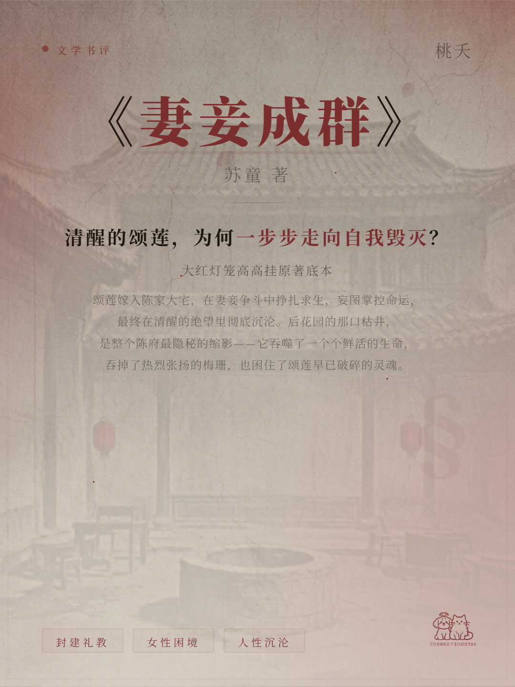
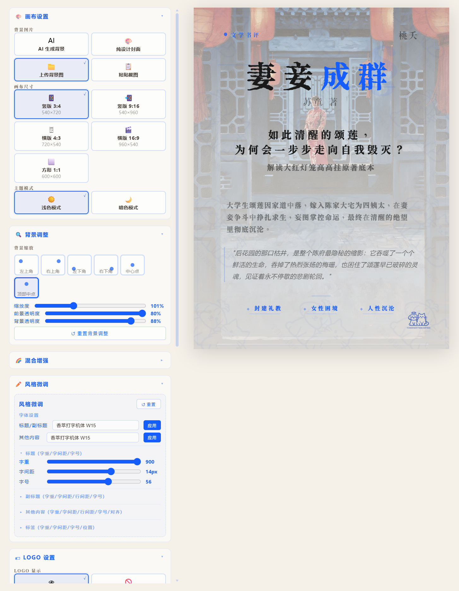
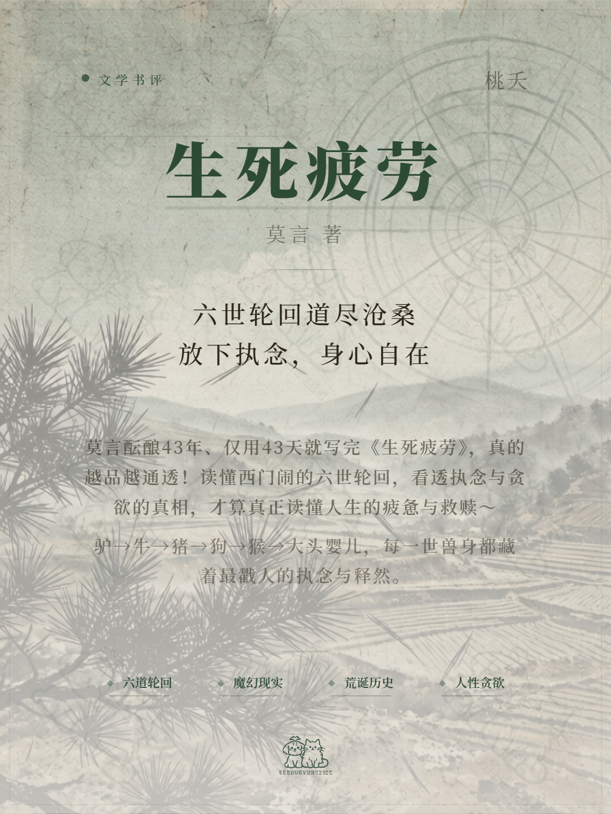
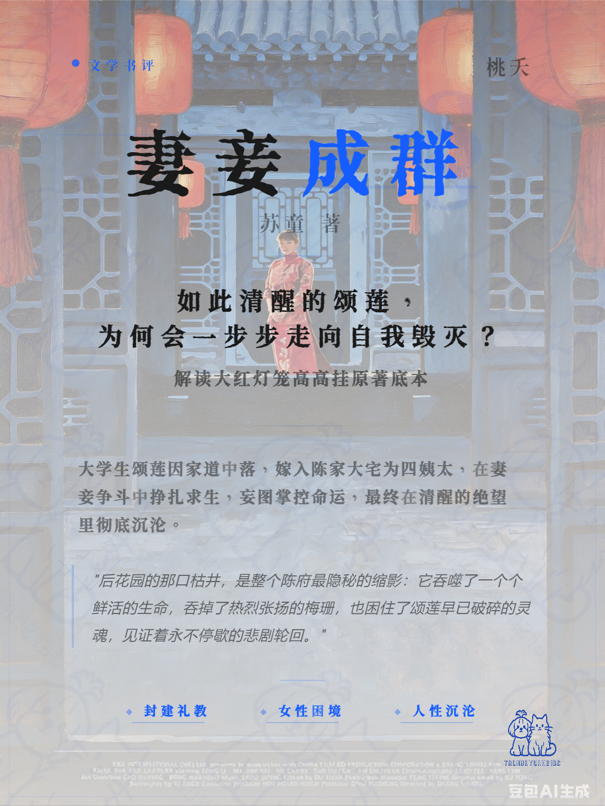
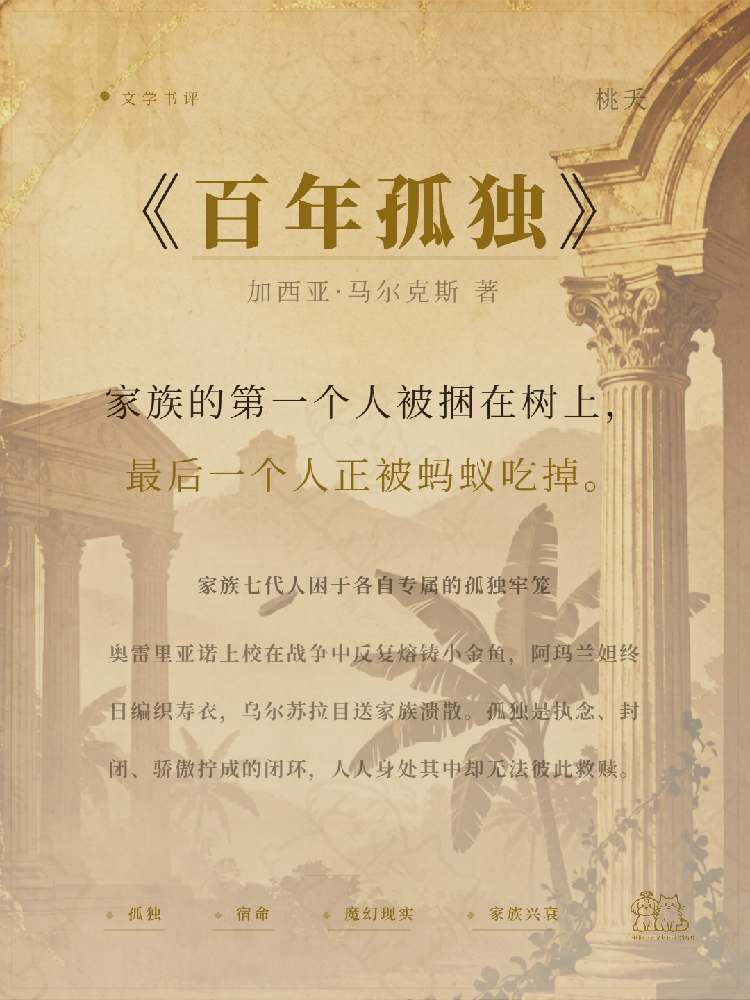
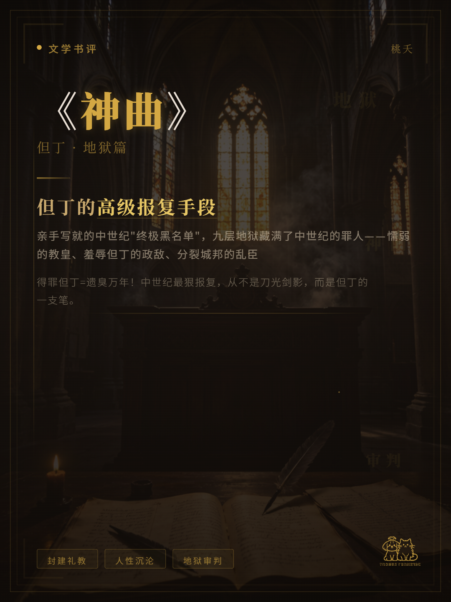
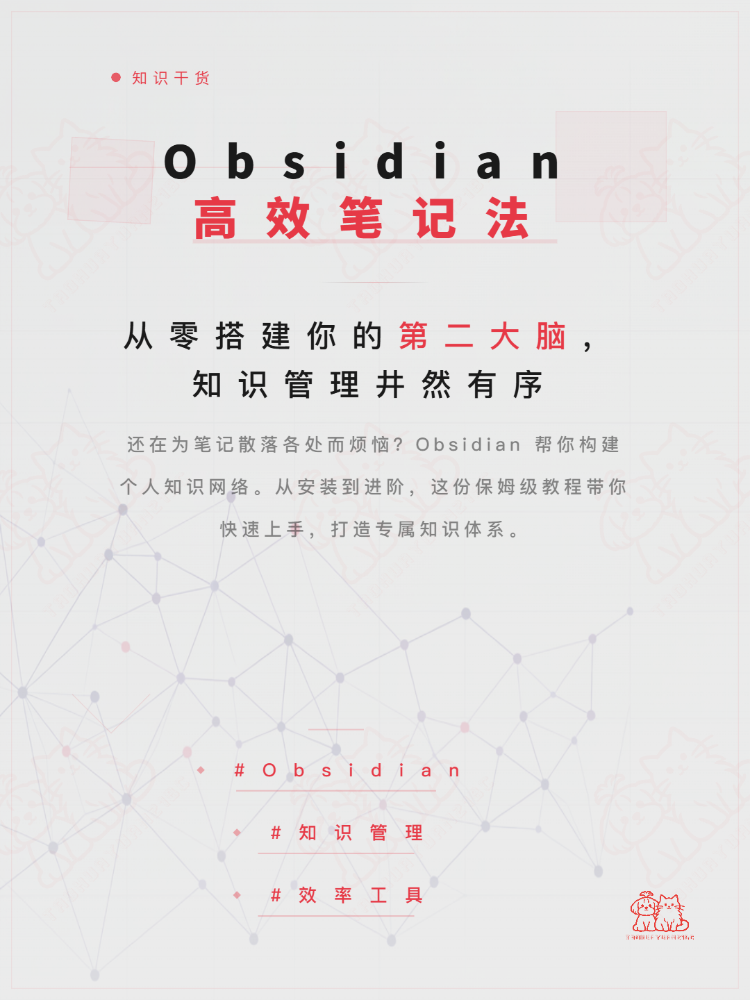
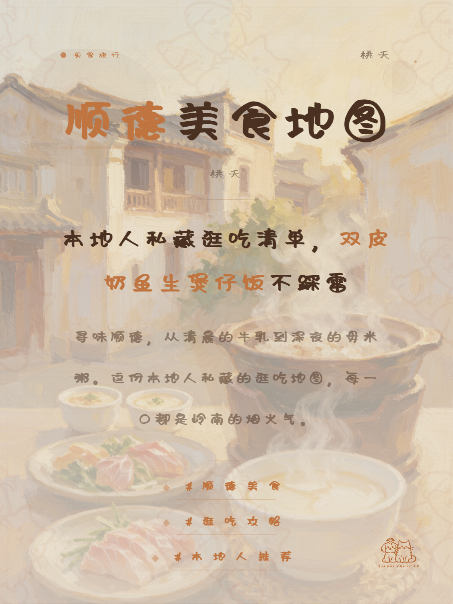
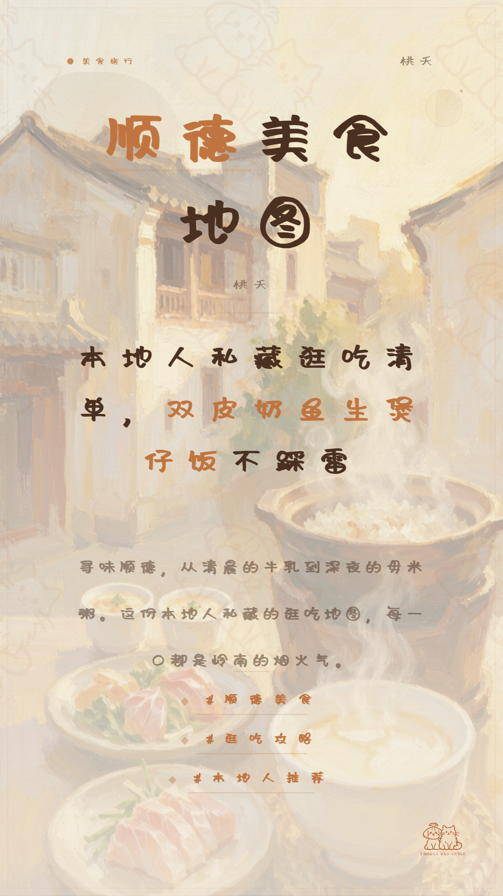

# 小红书封面设计技能包

> 生成小红书封面 HTML 预览页面。提供 31 种设计风格、6 套排版模板、8 类字体系统和 60+ 视觉装饰元素，支持智能匹配 3 套差异化方案点选输出。

---

## 📋 目录

- [技能概述](#-技能概述)
- [功能特性](#-功能特性)
- [安装步骤](#-安装步骤)
- [使用方法](#-使用方法)
- [🖼️ 案例展示](#️-案例展示)
- [配置指南](#-配置指南)
- [文件结构](#-文件结构)
- [常见问题解答](#-常见问题解答)
- [贡献指南](#-贡献指南)
- [许可证](#-许可证)
- [资源说明](#-资源说明)
- [图片索引](#-图片索引)

---

## 🌟 技能概述

**xiaohongshu-cover** 是一个专为小红书平台设计的封面生成技能包，基于模块化架构，提供智能内容分析和多方案匹配能力。

### 核心能力

| 能力 | 说明 |
|------|------|
| **智能匹配** | 基于内容品类、调性、受众、字数四维度自动分析，生成 3 套差异化方案 |
| **多方案输出** | 流量爆款风 / 质感高级风 / 小众特色风，用户可点选选择 |
| **实时预览** | 生成 HTML 预览页面，支持实时调节和导出 |
| **AI 背景图** | 支持 AI 生成背景图，提供多种风格的 Prompt 模板 |

### 封面效果预览

图1-1：技能生成的小红书封面效果示例



---

## ✨ 功能特性

### 设计资源

- **31 种设计风格**：涵盖美妆、美食、知识干货、穿搭、旅行、书评、职场、情感等 12 类内容场景
- **6 套排版模板**：大字标题型、左图右文型、上下分栏型、卡片拼接型、留白极简型、新中式禅意型
- **8 类字体系统**：衬线经典、无衬线现代、极粗醒目、圆润可爱、手写文艺、楷体传统、未来科技、哥特古典
- **60+ 视觉装饰元素**：肌理纹理、装饰线条、图标符号、色块拼接、噪点质感、国风纹样、潮玩几何

### 智能匹配引擎

```
用户输入分析
├─ 品类识别（12 类）
├─ 调性分析（6 种）
├─ 受众识别
└─ 字数分级
       ↓
生成 3 套差异化方案（A/B/C）
```

### 输出能力

- 支持 5 种封面尺寸：3:4、1:1、9:16、4:3、16:9
- 导出格式：PNG、JPG、WebP（2 倍像素高清）
- 左侧面板实时调节：风格微调、尺寸切换、LOGO 上传/布局/显示切换、水印、背景缩放/透明度/混合模式

### 操作界面概览

图2-1：封面生成操作界面，左侧为调节面板，右侧为实时预览区域



> **标注说明**：
> - ① 画布设置区：切换封面尺寸、主题模式
> - ② 背景调整区：上传背景图、调整缩放和透明度
> - ③ 混合增强区：调整对比度、亮度、饱和度等参数
> - ④ 风格微调控件：精细调节标题、副标题、内容、标签的样式
> - ⑤ LOGO 设置区：上传自定义 LOGO、调整位置和显示
> - ⑥ 水印设置区：添加水印、调整数量和样式
> - ⑦ 导出按钮：支持 PNG/JPG/WebP 三种格式导出

---

## 🚀 安装步骤

### 方法一：下载技能包

1. 前往 GitHub Releases 页面下载最新版本
2. 解压 `xiaohongshu-cover-v28.1.zip` 到本地目录

### 方法二：克隆仓库

```bash
git clone https://github.com/taohuayuan21bc/xiaohongshu-cover.git
cd xiaohongshu-cover
```

### 环境要求

- 支持现代浏览器（Chrome、Firefox、Safari、Edge）
- 无需额外依赖，纯 HTML/CSS/JS 实现

---

## 📖 使用方法

### 基础工作流

```
Step 0：内容收集
    ├─ 用户提供文案 或 AI 创作文案
    └─ 账号名称（可选）
       ↓
Step 1：智能匹配
    ├─ 分析内容（品类/调性/受众/字数）
    ├─ 生成 3 套方案（A/B/C）
    └─ 用户点选选择方案
       ↓
Step 2：生成封面
    ├─ 加载对应风格/模板/字体资源
    ├─ 注入内容到框架
    └─ 预览封面
       ↓
Step 3：AI 背景图（可选）
    ├─ 生成 1-3 张 AI 背景图
    └─ 用户选择并应用
       ↓
Step 4：最终交付
    └─ 用户可通过面板实时调节
```

### 操作步骤详解

#### Step 0：内容收集

系统会询问您的内容来源和账号名称：
- **内容来源**：您可以提供具体文案，或给出主题让 AI 帮您创作
- **账号名称**：可选填写，用于在封面上展示您的账号

#### Step 1：智能匹配

系统会分析您的内容，自动生成 3 套差异化方案：
- **方案 A（流量爆款风）**：高对比度、强 accent 色、暖色系，点击率优先
- **方案 B（质感高级风）**：低饱和度、莫兰迪色系、中性色，品牌感优先
- **方案 C（小众特色风）**：特色配色、风格化设计，记忆点优先

您只需点击选择喜欢的方案即可。

#### Step 2：生成封面

系统加载对应资源并生成封面 HTML 文件，自动打开预览。

图3-1：生成的封面预览界面


#### Step 3：AI 背景图（可选）

系统会询问是否需要 AI 生成背景图：
- 选择"需要"：AI 根据封面风格生成 1-3 张背景图供选择
- 选择"不需要"：保留纯设计封面

#### Step 4：最终交付

交付后您可以通过左侧面板进行实时调节：
- 调整风格参数（字重、字间距、字号等）
- 切换封面尺寸
- 上传自定义 LOGO 和背景图
- 添加水印

### 使用示例

**示例 1：智能匹配模式**

```
用户：帮我做一个关于"夏日护肤攻略"的小红书封面

系统：分析内容后推荐 3 套方案
├─ 方案 A：流量爆款风（高对比、强 accent、暖色系）
├─ 方案 B：质感高级风（低饱和、莫兰迪、中性色系）
└─ 方案 C：小众特色风（特色配色、风格化）

用户选择方案 B → 生成封面 → 预览 → 交付
```

**示例 2：直接指定风格**

```
用户：帮我做一个封面，使用 #7 瑞士国际主义风格

系统：直接加载 #7 风格资源 → 生成封面 → 预览 → 交付
```

### 快捷键

| 快捷键 | 功能 |
|--------|------|
| `Ctrl + E` | 导出图片 |
| `Ctrl + S` | 保存预设 |
| `1-5` | 切换封面尺寸（3:4/1:1/9:16/4:3/16:9） |

---

## 🖼️ 案例展示

### 文学书评论类

#### 案例 1：《生死疲劳》书评封面

图4-1：《生死疲劳》书评封面（国风雅致风格）



**案例概述**：为莫言作品《生死疲劳》设计的书评封面，采用国风雅致风格，水墨意境，体现文学作品的厚重感。

**重点标注**：
- 主标题："生死疲劳"采用书法字体，突出文学气质
- 副标题："莫言代表作"简洁点明书籍地位
- 装饰元素：水墨笔触和祥云纹样，营造古典氛围
- 配色：水墨灰为主色调，点缀红色 accent

#### 案例 2：《妻妾成群》书评封面

图4-2：《妻妾成群》书评封面（复古港风风格）



**案例概述**：为苏童作品《妻妾成群》设计的书评封面，采用复古港风风格，带有年代感和文艺气息。

**重点标注**：
- 主标题："妻妾成群"采用衬线字体，复古感十足
- 副标题："苏童经典作品"点明作者
- 装饰元素：复古边框和花纹
- 配色：暖色调为主，营造怀旧氛围

#### 案例 3：《百年孤独》书评封面

图4-3：《百年孤独》书评封面（暗黑质感风格）



**案例概述**：为马尔克斯作品《百年孤独》设计的书评封面，采用暗黑质感风格，体现魔幻现实主义的神秘氛围。

**重点标注**：
- 主标题："百年孤独"采用哥特字体，神秘感十足
- 副标题："魔幻现实主义巅峰之作"点明作品地位
- 装饰元素：星空和神秘图案
- 配色：深色系为主，金色 accent 点缀

#### 案例 4：《神曲·地狱篇》书评封面

图4-4：《神曲·地狱篇》书评封面（未来科技风格）



**案例概述**：为但丁作品《神曲·地狱篇》设计的书评封面，采用未来科技风格，展现地狱的神秘感和视觉冲击力。

**重点标注**：
- 主标题："神曲·地狱篇"采用科技感字体
- 副标题："但丁经典史诗"点明作品背景
- 装饰元素：科技线条和光效
- 配色：暗紫色为主，荧光色 accent

---

### 知识干货类

#### 案例 5：Obsidian 高效笔记法封面

图4-5：Obsidian 高效笔记法封面（瑞士国际主义风格）



**案例概述**：为"Obsidian 高效笔记法"主题设计的知识干货封面，采用瑞士国际主义风格，简洁现代，突出专业性。

**重点标注**：
- 主标题："Obsidian 高效笔记法"采用无衬线现代字体
- 副标题："打造第二大脑"点明核心价值
- 装饰元素：简洁的几何图形和线条
- 配色：蓝灰色系，科技感十足

---

### 美食探店类

#### 案例 6：顺德美食地图封面（3:4 竖版）

图4-6：顺德美食地图封面（清新自然风格，3:4 竖版）



**案例概述**：为"顺德美食地图"主题设计的美食封面，采用清新自然风格，展现美食的诱人感。

**重点标注**：
- 主标题："顺德美食地图"采用圆润可爱字体
- 副标题："寻味顺德，舌尖上的岭南"点明主题
- 装饰元素：美食相关图标和图案
- 配色：暖色系，橙色 accent 突出食欲

#### 案例 7：顺德美食地图封面（9:16 竖版）

图4-7：顺德美食地图封面（清新自然风格，9:16 竖版）



**案例概述**：同主题的 9:16 全屏视频封面版本，适合短视频内容使用。

**重点标注**：
- 布局调整：适配 9:16 比例，内容重新排版
- 主标题：保持一致性，字号适当放大
- 标签区域：底部标签更紧凑
- 尺寸：540×960px，适合全屏展示

---

### 封面案例对比

图4-8：不同风格封面案例对比

| 风格 | 适用场景 | 视觉特点 |
|------|---------|---------|
| 国风雅致 | 文学、传统文化 | 水墨、书法、古典纹样 |
| 复古港风 | 怀旧、文艺 | 暖色调、衬线字体、复古边框 |
| 暗黑质感 | 悬疑、神秘 | 深色系、哥特字体、光效 |
| 瑞士国际主义 | 科技、知识干货 | 简洁、几何、无衬线字体 |
| 清新自然 | 美食、旅行 | 明亮、圆润、自然元素 |

---

## ⚙️ 配置指南

### 风格编号对照

| 编号 | 风格名称 | 适用场景 |
|------|---------|---------|
| #1 | 日系清新 | 生活、日常、治愈 |
| #2 | 复古港风 | 穿搭、美妆、怀旧 |
| #3 | 极简留白 | 知识、干货、高端 |
| #4 | 撞色活力 | 运动、健身、青春 |
| #5 | 国风雅致 | 文化、传统、书法 |
| #6 | 轻奢高级 | 时尚、奢侈品、高端 |
| #7 | 瑞士国际主义 | 科技、产品、现代 |
| #8 | 水墨意境 | 文学、艺术、古典 |
| #9 | 扁平几何 | 数据、图表、科普 |
| #10 | 渐变流光 | 美妆、时尚、梦幻 |
| #11 | 暗黑质感 | 潮酷、个性、小众 |
| #12 | 清新自然 | 美食、旅行、户外 |
| ... | ... | ... |

完整风格列表见 [design-styles-reference.md](references/design-styles-reference.md)

### 模板类型

| 编号 | 模板名称 | 特点 |
|------|---------|------|
| T1 | 大字标题型 | 主标题占主导，醒目吸睛 |
| T2 | 左图右文型 | 图文并茂，信息丰富 |
| T3 | 上下分栏型 | 层次分明，结构清晰 |
| T4 | 卡片拼接型 | 模块化设计，灵活组合 |
| T5 | 留白极简型 | 大量留白，高级质感 |
| T6 | 新中式禅意型 | 东方美学，意境深远 |

### 字体分类

| 分类ID | 分类名 | 适用风格 |
|--------|-------|---------|
| F1 | 衬线经典 | #1 #2 #3 #4 #5 #6 #14 #15 #18 #19 #24 #27 #28 #29 |
| F2 | 无衬线现代 | #7 #9 #10 #11 #12 #13 #16 #17 #20 #25 #26 #30 |
| F3 | 极粗醒目 | #21 #22 #31 |
| F4 | 圆润可爱 | #21 #23 |
| F5 | 手写文艺 | #8 #24 |
| F6 | 楷体传统 | #8 #31 |
| F7 | 未来科技 | #7 #11 |
| F8 | 哥特古典 | #2 #6 |

---

## 📁 文件结构

```
xiaohongshu-cover/
├── assets/                    # 资源文件
│   ├── decor-html/           # 装饰元素 HTML 模板（31 个）
│   ├── styles-css/           # 风格 CSS 模板（31 个）
│   ├── images/               # 示例图片（案例截图和操作界面）
│   │   ├── 后期微调操作界面.png
│   │   ├── 封面-Obsidian高效笔记法-20260704.png
│   │   ├── 封面-妻妾成群-20260705.png
│   │   ├── 封面-生死疲劳-20260703.png
│   │   ├── 封面-百年孤独-20260703.jpg
│   │   ├── 封面-顺德美食地图-20260704-9.16.png
│   │   ├── 封面-顺德美食地图-20260704.png
│   │   ├── 小红书封面-神曲地狱篇.png
│   │   └── 小红书封面.png
│   ├── framework.css         # 框架 CSS（v28.1）
│   ├── framework.html        # 框架 HTML（v28.1）
│   └── framework.js          # 框架 JS（v28.1）
├── references/               # 参考文档
│   ├── fonts/                # 字体模块（8 个）
│   │   ├── font-catalog.md       # 字体分类总索引
│   │   ├── font-match-engine.md  # 风格→字体映射
│   │   ├── serif-classic.md      # 衬线经典
│   │   ├── sans-modern.md        # 无衬线现代
│   │   ├── extreme-bold.md       # 极粗醒目
│   │   ├── rounded-cute.md       # 圆润可爱
│   │   ├── handwriting.md        # 手写文艺
│   │   ├── kaiti-traditional.md  # 楷体传统
│   │   ├── scifi-tech.md         # 未来科技
│   │   └── gothic-classical.md   # 哥特古典
│   ├── ai-bg-prompt-templates.md    # AI 背景 Prompt 模板
│   ├── architecture-optimization-v22.md
│   ├── decor-elements-reference.md  # 装饰元素参考
│   ├── design-styles-reference.md   # 设计风格参考
│   ├── html-template-reference.md   # HTML 模板参考
│   ├── layout-templates.md          # 排版模板
│   ├── new-features-summary-v22.md
│   ├── option-panel-reference.md    # 选项面板参考
│   ├── shared-components.md         # 共享组件
│   ├── smart-match-engine.md        # 智能匹配引擎
│   ├── test-report-v22.md
│   ├── typography-system.md         # 文字样式体系
│   └── visual-elements-library.md   # 视觉元素库
├── scripts/                  # 脚本工具
│   └── generate_templates.py   # 模板生成脚本
├── CHANGELOG.md              # 版本变更日志
├── SKILL.md                  # 技能核心定义（v28.1）
└── README.md                 # 项目说明文档
```

---

## ❓ 常见问题解答

### Q1：封面右下角出现方框是什么原因？

**原因**：这是 LOGO 预览元素的空 src 导致的浏览器渲染问题。

**解决方案**：v28.1 已彻底修复此问题，`.logo-preview` 默认 `display:none`，无自定义 LOGO 时不渲染。

### Q2：如何自定义 LOGO？

1. 在左侧面板找到「🏷 LOGO 设置」折叠面板（图2-1 中⑤区域）
2. 点击「自定义 LOGO 上传」上传图片
3. 选择 LOGO 位置：右下角/左下角/底部居中/顶部居中
4. 点击「显示 LOGO」或「隐藏 LOGO」控制显示

### Q3：支持哪些封面尺寸？

- **3:4**（默认）：540×720px，适合小红书竖版封面（如图4-6）
- **1:1**：600×600px，适合正方形内容
- **9:16**：540×960px，适合全屏视频封面（如图4-7）
- **4:3**：720×540px，适合横版内容
- **16:9**：960×540px，适合宽屏内容

### Q4：如何导出高清图片？

1. 点击底部「导出 PNG/JPG/WebP」按钮（图2-1 中⑦区域）
2. 导出时自动使用 2 倍像素（如 3:4 导出为 1080×1440px）
3. 支持切换导出格式（PNG/JPG/WebP）

### Q5：AI 背景图生成失败怎么办？

1. 检查网络连接
2. 确认输入内容符合平台规范
3. 尝试重新生成
4. 如仍失败，选择「不需要，纯设计封面即可」

### Q6：如何保存我的自定义设置？

1. 调节好各项参数后，点击「💾 保存当前预设」
2. 设置会保存在本地浏览器 localStorage 中
3. 下次使用时点击「📂 加载我的预设」恢复

---

## 🤝 贡献指南

### 开发流程

1. **Fork 仓库**：点击 GitHub 页面右上角的 Fork 按钮
2. **克隆到本地**：`git clone https://github.com/taohuayuan21bc/xiaohongshu-cover.git`
3. **创建分支**：`git checkout -b feature/your-feature-name`
4. **开发**：实现功能或修复问题
5. **提交**：`git commit -m "feat: 添加新功能"`
6. **推送**：`git push origin feature/your-feature-name`
7. **创建 PR**：在 GitHub 页面创建 Pull Request

### 贡献规范

#### 提交信息格式

```
<类型>: <描述>

<详细说明（可选）>
```

| 类型 | 说明 |
|------|------|
| `feat` | 新功能 |
| `fix` | 修复问题 |
| `docs` | 文档更新 |
| `style` | 代码风格调整 |
| `refactor` | 重构 |
| `test` | 测试 |
| `chore` | 其他更改 |

#### 代码规范

- HTML/CSS/JS 代码保持整洁
- 函数和变量命名清晰
- 添加必要的注释
- 遵循现有代码风格

### 新增风格指南

1. 在 `assets/styles-css/` 创建新的 CSS 文件
2. 在 `assets/decor-html/` 创建对应的装饰 HTML
3. 在 `references/design-styles-reference.md` 添加风格定义
4. 在 `references/fonts/font-match-engine.md` 添加字体映射
5. 在 `references/ai-bg-prompt-templates.md` 添加 AI Prompt

---

## 📄 许可证

MIT License

---

## 📞 联系方式

如有问题或建议，欢迎通过以下方式联系：

- GitHub Issues：[提交问题](https://github.com/taohuayuan21bc/xiaohongshu-cover/issues)
- GitHub 账号：[taohuayuan21bc](https://github.com/taohuayuan21bc)
- 邮箱：taohuayuan21bc@yeah.net

---

## 📦 资源说明

本文档中所有 PNG 格式案例文件及操作界面截图均为项目原创资源。如有使用疑问，请联系：GitHub 账号 taohuayuan21bc 或邮箱 taohuayuan21bc@yeah.net

---

## 📷 图片索引

| 图号 | 图片名称 | 章节位置 | 说明 |
|------|---------|---------|------|
| 图1-1 | 小红书封面.png | 技能概述 | 封面效果预览示例 |
| 图2-1 | 后期微调操作界面.png | 功能特性 | 操作界面概览，标注各功能区域 |
| 图3-1 | 后期微调操作界面.png | 使用方法 | 封面预览界面示例 |
| 图4-1 | 封面-生死疲劳-20260703.png | 案例展示 | 《生死疲劳》书评封面（国风雅致风格） |
| 图4-2 | 封面-妻妾成群-20260705.png | 案例展示 | 《妻妾成群》书评封面（复古港风风格） |
| 图4-3 | 封面-百年孤独-20260703.jpg | 案例展示 | 《百年孤独》书评封面（暗黑质感风格） |
| 图4-4 | 小红书封面-神曲地狱篇.png | 案例展示 | 《神曲·地狱篇》书评封面（未来科技风格） |
| 图4-5 | 封面-Obsidian高效笔记法-20260704.png | 案例展示 | Obsidian 高效笔记法封面（瑞士国际主义风格） |
| 图4-6 | 封面-顺德美食地图-20260704.png | 案例展示 | 顺德美食地图封面（清新自然风格，3:4 竖版） |
| 图4-7 | 封面-顺德美食地图-20260704-9.16.png | 案例展示 | 顺德美食地图封面（清新自然风格，9:16 竖版） |

---

**版本**：v28.1  
**最后更新**：2026-07-05  
**状态**：持续维护中